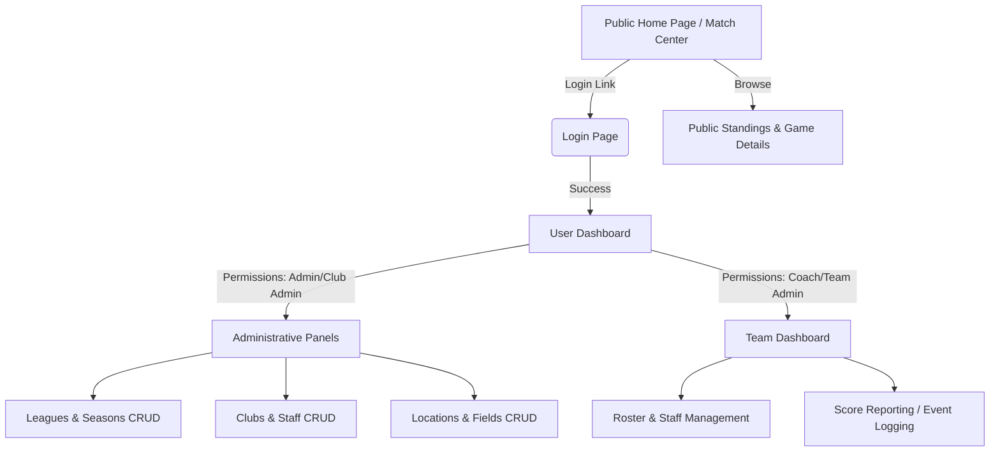

# Application Blueprint: General Soccer App v4

This document outlines the architecture, database schema, permission structure, navigation flows, and technical objectives of the General Soccer Application. It serves as a master reference for developers working on the application.

---

## 1. Domain Logic & Data Model

The application is built on a relational database managed through Prisma. The models can be categorized into four primary domains: **Organization Structure**, **Personnel & Staffing**, **Scheduling & Match Operations**, and **Statistical Event Tracking**.

### 1.1 Organization & Structure

- **governing_bodies**: Regional or national soccer bodies (e.g. USYS, TSSA) governing the organization.
- **leagues**: Hierarchical league configurations containing multiple divisions and nodes.
- **league_nodes**: Represent divisions, brackets, or specific age brackets within a league.
- **seasons**: Time periods (e.g., "Fall 2026", "Spring 2027") binding matches and league standings.
- **league_node_seasons**: Junction table tracking active nodes in a given season.
- **clubs**: Entities running soccer teams, including both independent clubs and high schools.
- **teams**: Core soccer teams under clubs.
- **team_seasons**: Teams registered for a particular season (combines age groups and gender settings).
- **age_groups**: Standard soccer classifications (e.g. U10, U14) defined by birth date ranges.

### 1.2 Personnel & Roster Management

- **people**: Unified table storing basic information (first/last name, email, phone) for all individuals.
- **users**: Login credentials, passwords (bcrypt-hashed), password reset tokens, and system-admin flags.
- **club_staff**: Maps people to club-level roles (e.g., Club Administrator, Director of Coaching).
- **team_staff**: Maps people to team-specific staff roles (e.g., Head Coach, Assistant Coach, Team Manager, Stats Keeper).
- **player_teams**: Active players rostered for a specific `team_season`.
- **player_relationships**: Parent-to-player relationships (Parent, Guardian).

### 1.3 Scheduling & Venues

- **addresses**: Mailing addresses linked to clubs or physical match locations.
- **locations**: Field complexes or stadium facilities where matches are played.
- **sublocations**: Specific fields, pitches, or courts within a main location (e.g., "Field 3A").
- **games**: Match fixtures scheduling a Home `team_season` and Away `team_season` on a start date and time.
- **game_standings_inclusions**: Flags whether a specific game contributes to standard league standings tables.

### 1.4 Live Match Operations & Stats

- **game_periods**: Logged halves or overtime period timestamps (start/end/run-time).
- **game_subs**: Substitution log tracking when a player enters/exits the match and whether they are a goalkeeper.
- **game_events_major**: Central match log (goals, cards, shootouts) indexed by period and game-clock time.
- **game_events_goals**: Detailed goal info linking the scorer, the assister, the opposing goalkeeper, own-goal flags, and scoring types (e.g., header, free kick).
- **game_events_penalties**: Penalty shootouts or in-game penalty kicks.
- **game_events_discipline**: Red and yellow cards with matching reasons and durations.
- **game_events_player_actions**: Micro-statistics (e.g., shots, saves, fouls) logged at the player level.
- **game_events_team**: Team-wide events (e.g., timeouts, team fouls).
- **games_overtimes**: Extra-time match guidelines (OT minutes, shootout configurations).

---

## 2. Authentication & Authorization

Authentication is managed via **NextAuth.js** with a customized database JWT provider and credentials verification.

### 2.1 Role Hierarchy & Scopes

The app defines six core user roles:

1.  **System Admin (ADMIN)**: Full read-write permission to all administrative modules, schema definitions, and user settings.
2.  **Club Admin (CLUB_ADMIN)**: View and edit all team seasons, staff rosters, and locations owned by their club.
3.  **Team Admin (TEAM_ADMIN)**: Edit rosters and input statistics for assigned teams.
4.  **Coach (COACH)**: Report scores, edit player rosters, and review game event timelines.
5.  **Parent (PARENT)**: View team calendar details, team staff contacts, and statistics of their children.
6.  **Player (PLAYER)**: Access team calendar, view performance metrics, and review match results.
7.  **Public (PUBLIC)**: Unauthenticated visitor role with read-only access to matches and schedules.

### 2.2 Active Role View Switching (Dev & Admin Feature)

To facilitate testing and multi-role users, the application supports **Active Role View Switching**.

- Admins and Club Admins can switch their perspective dynamically (stored in cookies) to view the application as a Coach, Team Admin, Player, or Parent.
- The backend session helper (`getServerAuthSession`) automatically resolves these override cookie configurations to modify active permissions.

---

## 3. Dynamic UI Engine (Entity Shell & Admin Pages)

The application utilizes a meta-configured CRUD engine to render administrative interfaces uniformly.

### 3.1 Architecture

- **`EntityConfig` (Schema Mapping)**: Declarative configs mapping data fields to display names, field types (select, text, checkbox), and role-based permissions (view/edit/create/delete).
- **`EntityShell` (Server Component)**: Container fetching relevant data, checking middleware auth, and supplying standard actions (`onCreate`, `onUpdate`, `onDelete`).
- **`EntityPage` (Client Component)**: Renders search fields, status filters, and table dashboards using `@tanstack/react-table` (via `GenericTable`), and handles modals and edit state transitions using `GenericForm`.

---

## 4. Navigation Flow & Routes

The application routing is structured as follows:

---

## 5. Development Roadmap & Tasks

Based on existing `todo.md` notes and active priorities:

1.  **Redirection Integrity**: Fully preserve original navigation targets when prompting users to log in (Completed: callback URL tracking implemented in middleware).
2.  **Selector Display Bug**: Fix table rendering to show the textual label instead of the database ID when a `select` input is edited or updated.
3.  **Role Switch Integration**: Ensure active dev/admin role switching propagates correctly across database reads.
4.  **Standings Calculations**: Integrate background queries to compute and update league standings points in real-time as goals and match outcomes are submitted.
5.  **Offline-Capable Logging**: Provide client-side logging helpers for coaches recording games in areas with weak cellular service.
