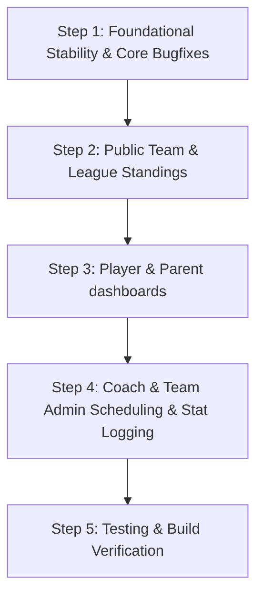

# Implementation Plan: Full-Featured General Soccer App v4

This plan outlines the systematic implementation of features required to transition the application from a skeletal schema shell into a fully functional soccer organization management system.

## Proposed Steps

The development workflow is broken down into five logical steps:

---

## Step 1: Foundational Stability & Core Bugfixes

Address the outstanding items in the immediate `todo.md` checklist.

### 1.1 Table Label Display Mismatch
*   **Problem**: When editing an entity's `select` fields, the data table incorrectly shows the database foreign key ID (e.g. `2`) instead of the human-readable text label (e.g. "TSSA").
*   **Fix**: Update the state merge logic in [EntityPage.tsx](file:///c:/Users/decor/Development/general_soccer_app_v4/src/components/entities/EntityPage.tsx) so it merges the prepared `displayPatch` object (containing display labels) into the table's active state rather than the raw `formData`.

### 1.2 Homepage to Dashboard Smart-Redirect
*   **Behavior**:
    *   Unauthenticated guests land on `/` to see the public match center (fixtures and results).
    *   Authenticated users accessing `/` are automatically redirected to `/dashboard`.
*   **Fix**: Add an authentication session check to [page.tsx](file:///c:/Users/decor/Development/general_soccer_app_v4/src/app/(mainAppLayout)/page.tsx) to redirect logged-in users to `/dashboard`.

### 1.3 Dev & Admin Role Selector Persistence
*   **Behavior**: Ensure active view switching cookies dynamically update navigation menus and filter database queries based on simulated roles.

---

## Step 2: Public View - Teams, Schedules, and Standings

Provide a comprehensive, unauthenticated visitor portal.

### 2.1 Public Leagues & Standings Pages
*   **Abstractions**:
    *   Create `/leagues` view displaying list of active leagues/divisions.
    *   Create dynamic route `/leagues/[leagueId]` page rendering the division standings table.
*   **Database Calculations**:
    *   Write a Prisma query helper in [queries.ts](file:///c:/Users/decor/Development/general_soccer_app_v4/src/lib/data/queries.ts) to calculate standings dynamically: `Wins (3 pts)`, `Draws (1 pt)`, `Losses (0 pts)`, `Goals For (GF)`, `Goals Against (GA)`, and `Goal Difference (GD)`.

### 2.2 Public Team Detail Pages
*   **Location**: [teams/[teamSeasonId]/page.tsx](file:///c:/Users/decor/Development/general_soccer_app_v4/src/app/(mainAppLayout)/teams/[teamSeasonId]/page.tsx)
*   **Enhancements**:
    *   Render full team rosters (jersey numbers, player names).
    *   Show detailed schedules (past game results and future fixtures).
    *   Display player statistics tables (Goals, Assists, Cards, Clean Sheets).

---

## Step 3: Player & Parent Dashboards (Assigned Access Only)

Display user-specific schedules and statistics.

### 3.1 Restricted Dashboard Rendering
*   **Behavior**: Limit data query results in `/dashboard` based on resolved JWT token lists:
    *   `roles.playerTeamIds` for players.
    *   `roles.parentTeamIds` for parents.
*   **UI Components**:
    *   Personalized calendar showing upcoming matches and practice events.
    *   Parent view linking child player roster stats.

---

## Step 4: Coach & Team Admin Controls

Administrative and statistics logging tools.

### 4.1 Team Roster Adjustments
*   **Features**:
    *   Add players to a team roster.
    *   Edit player jersey numbers.
    *   Add/remove team staff (head coach, assistant, stats keeper).
*   **Location**: Create `/dashboard/roster` or integrate directly into the `TeamPageClient` for authorized coach roles.

### 4.2 Game Scheduling & Venue Booking
*   **Features**:
    *   Add new matches, selecting dates, times, opponent teams, locations, and sublocation fields.
    *   Prevent double-booking warning indicators on fields/venues.
*   **Location**: Create server actions and scheduling modals.

### 4.3 Match Statistics Logger (Live Game Tracker)
*   **Features**:
    *   Start/stop period clocks.
    *   Substitutions logger (who went out, who came in, game minute).
    *   Goal recorder (scorer, assist, type: header/penalty/etc.).
    *   Discipline logs (yellow card, red card, duration/reasons).
*   **Location**: Create a game details administration route `/dashboard/games/[gameId]/edit`.

---

## Step 5: Verification & Automated Tests

*   Run automated Next.js build compilation.
*   Verify navigation redirects and role switches.
